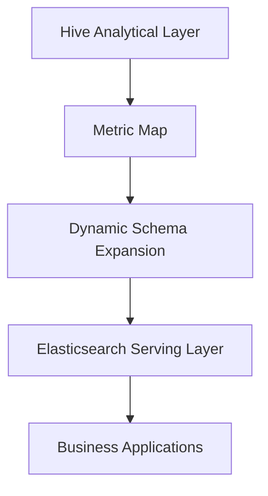

# Analytical Platform Architecture

Enterprise Metric Platform — Ping An Securities

---

## Background

Enterprise securities analytics requires querying thousands of metrics across
PB-scale historical data. Business teams need interactive search over metric
definitions and values, not batch Hive query submission with hours-long
wait times.

The analytical platform needed to bridge large-scale batch computation with
sub-second interactive search while handling schema complexity that exceeds
traditional database field limits.

---

## Problem

Enterprise metric platforms at PB scale face structural challenges:

- Hive tables with 2000+ physical columns exceed practical query and schema
  management limits
- Elasticsearch field limits (typically 1000 fields per index) conflict with
  100000+ searchable metric requirements
- Business users require interactive search, not SQL expertise
- Analytical computation and search serving have different scaling profiles

A monolithic approach — compute and serve from the same system — fails at
this scale and access pattern diversity.

---

## Requirements

**Functional**

- Support 100000+ searchable metric fields for business applications
- Process PB-scale analytical workloads on 1000+ vCore cluster
- Enable dynamic addition of new metrics without manual schema migration
- Provide interactive search over metric definitions and computed values

**Non-functional**

- Decouple analytical computation from search serving
- Optimize Hive and Hadoop resource utilization across the cluster
- Maintain query performance as metric count grows

---

## Architecture

### Components

**Hive Analytical Layer**

PB-scale batch computation engine processing historical data across the
1000+ vCore Hadoop cluster. Generates metric values from raw analytical
datasets with 2000+ physical columns per table.

**Metric Map**

Translation layer mapping Hive column structures to logical metric
definitions. Abstracts physical schema complexity from downstream consumers.

**Dynamic Schema Expansion**

Mechanism converting Hive analytical outputs to Elasticsearch index structures
without manual per-metric schema migration. Solves the field limit constraint
through Map-based schema translation.

**Elasticsearch Serving Layer**

Search engine exposing 100000+ searchable metric fields to business
applications. Provides sub-second interactive query capability over
pre-computed metric values.

**Business Applications**

Downstream consumers querying metrics through Elasticsearch APIs without
direct Hive or Hadoop access.

---

## Design Decisions

### Compute-Serve Separation

**Decision:** Compute metrics in Hive, serve through Elasticsearch. Never
serve directly from Hive.

**Rationale:** Batch computation and interactive search have incompatible
latency and scaling requirements. Separation allows each layer to optimize
independently.

**Trade-off:** Data freshness limited by batch computation schedule. Acceptable
for enterprise metric use cases where daily or hourly refresh suffices.

### Dynamic Schema via Map Translation

**Decision:** Map-based schema translation layer between Hive and Elasticsearch
rather than direct column-to-field mapping.

**Rationale:** Direct mapping fails when 2000+ Hive columns must become
100000+ searchable fields. Map translation provides indirection that scales
metric count without hitting Elasticsearch field limits per index.

**Trade-off:** Map layer adds transformation complexity and maintenance.
Necessary trade-off given field limit constraints.

### Hive Optimization as Platform Investment

**Decision:** Invest in Hive query plan optimization and Hadoop workload
isolation rather than migrating to a different compute engine.

**Rationale:** Existing PB-scale investment in Hadoop infrastructure.
Optimization delivers performance gains without migration risk.

**Trade-off:** Hive optimization has diminishing returns compared to modern
query engines. Acceptable given existing infrastructure scale and team
expertise.

---

## Trade-offs

| Decision | Benefit | Cost |
|----------|---------|------|
| Hive + Elasticsearch separation | Independent scaling of compute and search | Batch freshness latency |
| Map-based dynamic schema | 100K+ fields without per-metric migration | Translation layer complexity |
| PB-scale Hadoop retention | Leverages existing infrastructure investment | Hive optimization ceiling |
| 1000+ vCore cluster | Massive parallel batch throughput | Cluster operational overhead |

---

## Scalability

- Hive scales horizontally through additional worker nodes on the 1000+ vCore
  cluster
- Dynamic schema expansion handles new metrics without index restructuring
- Elasticsearch scales through index sharding and replica addition
- Metric Map layer scales independently as metric catalog grows

---

## Failure Recovery

- HDFS replication provides storage durability for PB-scale data
- Hive job retry at task level for partial computation failures
- Elasticsearch replica shards maintain search availability during node failures
- Metric Map versioning enables rollback when schema translation errors occur

---

## Lessons Learned

- At 100K+ metric scale, schema management is an architecture problem, not
  a configuration problem. Dynamic schema expansion is essential.
- Compute-serve separation is the correct pattern when batch and interactive
  access patterns coexist on the same data domain.
- Map-based indirection solves field limit constraints more effectively than
  index proliferation or nested document structures.

---

## Future Improvements

- Incremental metric computation reducing full batch recomputation cost
- Unified metric catalog with lineage from Hive source to Elasticsearch index
- Query push-down optimization reducing data movement between compute and
  serve layers
- Automated schema compatibility validation during metric onboarding
