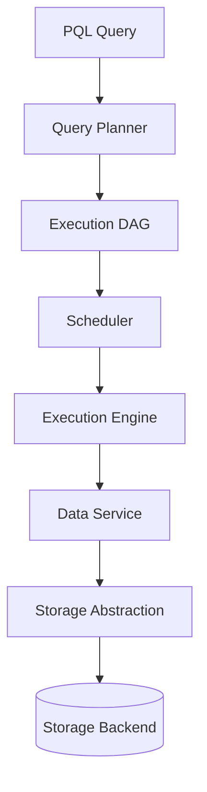

# Privacy Computing Platform Architecture

MIRA / ChainWeaver — Shanghai Puxin Future Internet Research Institute

---

## Background

Privacy computing requires executing analytical workloads across multiple
parties without exposing raw data. Application teams need to submit queries
declaratively while the platform handles distributed orchestration, data
access, and execution scheduling across heterogeneous backends.

The MIRA platform addresses this by treating execution planning as a
first-class capability rather than ad-hoc job scripting.

---

## Problem

Privacy computing workloads differ from traditional batch or streaming jobs
in several ways:

- Queries span multiple compute parties with strict data isolation constraints
- Execution graphs vary based on query semantics, not fixed pipeline templates
- Storage backends differ across deployment environments
- Performance optimization requires measurable benchmarking, not guesswork

Without a unified execution layer, each workload requires custom orchestration
code, increasing integration cost and reducing platform consistency.

---

## Requirements

**Functional**

- Accept declarative queries (PQL) and produce executable distributed plans
- Support cross-party computation through DAG-based workflow representation
- Provide unified data access regardless of underlying storage backend
- Enable benchmark-driven performance evaluation

**Non-functional**

- Stable interfaces between planner, scheduler, execution engine, and data
  service so components evolve independently
- Platform standardization across teams to reduce integration overhead
- Operational deployment on Kubernetes with containerized execution engines

---

## Architecture

### Components

**PQL Layer**

Declarative query interface. Application teams submit queries describing
what computation is needed, not how to orchestrate it across parties.

**Query Planner**

Converts PQL into logical execution plans. Performs operator rewriting and
cost-aware graph construction. Separates query semantics from execution
strategy.

**Execution DAG**

Distributed directed acyclic graph representing cross-party computation
workflows. Defines stage boundaries, dependencies, and parallel execution
opportunities.

**Scheduler**

Assigns DAG stages to available execution engines. Manages resource allocation
and execution ordering based on dependency resolution.

**Execution Engine**

Runs individual computation stages. Consumes data through the Data Service
interface rather than direct storage access.

**Data Service**

Reusable data access layer providing read/write operations across storage
backends through stable interfaces.

**Storage Abstraction**

Decouples execution logic from physical storage. Supports multiple backends
through a consistent contract.

---

## Design Decisions

### Execution Planning as Platform Primitive

**Decision:** Build a dedicated query planner rather than template-based job
configuration.

**Rationale:** Privacy computing queries vary in structure. A planner adapts
execution graphs to query semantics, while templates require manual updates
for each new pattern.

**Trade-off:** Planner complexity increases upfront engineering cost, but
reduces per-workload integration effort at scale.

### Storage Abstraction Layer

**Decision:** Introduce storage abstraction between execution engines and
physical storage.

**Rationale:** Different deployments use different storage backends. Abstraction
prevents execution engine code from binding to specific storage implementations.

**Trade-off:** Abstraction adds indirection latency. Mitigated by keeping the
interface thin and push-down optimizations where possible.

### Benchmark Platform

**Decision:** Build a dedicated benchmark platform for execution planning
and runtime performance measurement.

**Rationale:** Optimization without measurement leads to incorrect assumptions.
Benchmark platform provides evidence for planner and engine tuning decisions.

**Trade-off:** Benchmark infrastructure requires maintenance, but prevents
costly production performance surprises.

---

## Trade-offs

| Decision | Benefit | Cost |
|----------|---------|------|
| Declarative PQL over imperative scripts | Lower integration cost for app teams | Planner must handle diverse query patterns |
| DAG-based execution model | Flexible cross-party workflows | DAG scheduling complexity |
| Storage abstraction | Backend portability | Additional interface layer |
| Platform standardization | Consistent cross-team delivery | Upfront interface design effort |

---

## Scalability

- Planner generates DAGs independently per query; horizontal scaling through
  stateless planner instances
- Scheduler distributes stages across available execution engines
- Data Service scales with storage backend capacity
- Kubernetes enables elastic execution engine deployment

---

## Failure Recovery

- DAG stage failures trigger retry at stage boundary, not full query restart
- Scheduler tracks stage completion state for partial recovery
- Data Service idempotent read/write contracts prevent duplicate side effects

---

## Lessons Learned

- Separating query semantics from execution strategy is the highest-leverage
  abstraction in a privacy computing platform
- Platform interfaces must be defined before multiple teams integrate; retrofit
  standardization is significantly more expensive
- Benchmark infrastructure pays for itself when execution planning involves
  multiple optimization dimensions

---

## Future Improvements

- Cost-based plan selection using historical execution statistics
- Adaptive DAG rewriting based on runtime feedback
- Extended storage abstraction with push-down predicate filtering
- Cross-query resource sharing in the scheduler
