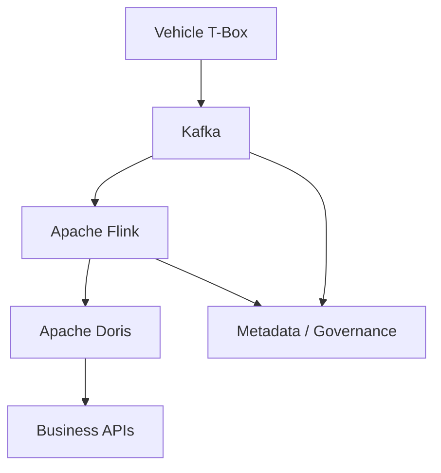

# Streaming Platform Architecture

Connected Vehicle Platform — Shanghai Jiayu Intelligent Robotics

---

## Background

Connected vehicle platforms generate continuous telemetry from millions of
onboard devices. Business applications require real-time access to processed
telemetry data for fleet management, diagnostics, and operational analytics.

The platform needed to handle national-scale device connectivity with burst
traffic patterns while maintaining data quality and discoverability across
downstream consumers.

---

## Problem

Vehicle telematics at scale presents distinct engineering challenges:

- Millions of T-Box devices produce heterogeneous, high-frequency telemetry
- Traffic bursts during peak hours exceed steady-state capacity by orders of
  magnitude
- Downstream teams need both real-time and analytical access to the same data
- Schema evolution across vehicle models requires governance, not ad-hoc fixes

A point-to-point integration model between devices and business applications
does not scale. A platform architecture with clear layer boundaries is required.

---

## Requirements

**Functional**

- Ingest telemetry from 1M+ connected vehicles
- Process 10B+ events per day through stream computation
- Serve real-time queries for business applications
- Provide metadata and data governance for downstream discovery

**Non-functional**

- Decouple ingestion from computation so each layer scales independently
- Support 1000+ vCore streaming cluster utilization
- Maintain data quality standards across telemetry datasets

---

## Architecture

### Components

**Vehicle T-Box (Ingestion Source)**

Onboard telematics devices transmitting sensor data, location, diagnostics,
and operational metrics. Heterogeneous message formats across vehicle models.

**Kafka (Ingestion Layer)**

Message broker decoupling device producers from downstream consumers.
Topic and partition design accommodates burst traffic while preserving
ordering per vehicle where required.

**Apache Flink (Stream Processing)**

Real-time computation layer for aggregation, enrichment, filtering, and
routing. Separates processing logic from ingestion and storage infrastructure.

**Apache Doris (Real-time Warehouse)**

Columnar storage and query engine serving low-latency analytical queries over
streaming-derived datasets. Chosen for query performance on high-volume
time-series workloads.

**Business APIs (Serving Layer)**

Application-facing interfaces consuming processed data from Doris. Decoupled
from raw ingestion and stream processing internals.

**Metadata and Data Governance**

Cross-cutting platform capability providing schema registration, lineage
tracking, and data quality enforcement.

---

## Design Decisions

### Kafka as Ingestion Boundary

**Decision:** Use Kafka as the mandatory boundary between device producers
and all downstream consumers.

**Rationale:** Decouples ingestion rate from processing capacity. Multiple
consumers (Flink, archival, monitoring) read from the same topics without
affecting device connectivity.

**Trade-off:** Kafka cluster operational overhead. Justified at 10B+
events/day scale where direct coupling fails.

### Flink for Stream Computation

**Decision:** Apache Flink as the primary stream processing engine.

**Rationale:** Stateful stream processing with exactly-once semantics for
aggregation and enrichment workloads. Mature ecosystem for operational
monitoring and job management.

**Trade-off:** Flink operational complexity on 1000+ vCore cluster. Mitigated
through Dinky platform integration for job lifecycle management.

### Doris as Real-time Warehouse

**Decision:** Apache Doris for the serving storage layer rather than serving
directly from Flink state or Kafka.

**Rationale:** Business APIs require ad-hoc analytical queries over historical
and real-time data. Columnar storage provides query performance for
time-series patterns at scale.

**Trade-off:** Additional storage layer adds ingestion latency from Flink to
Doris. Acceptable for business query patterns that tolerate seconds-level
freshness.

### Platform-level Metadata and Governance

**Decision:** Metadata and data governance as platform primitives, not
per-team conventions.

**Rationale:** At 1M+ device scale, schema discovery and data quality cannot
rely on tribal knowledge. Standardized metadata enables self-service for
downstream teams.

**Trade-off:** Governance enforcement adds friction to data onboarding.
Reduced downstream integration failures justify the cost.

---

## Trade-offs

| Decision | Benefit | Cost |
|----------|---------|------|
| Kafka ingestion boundary | Independent scaling of producers and consumers | Kafka cluster operations at scale |
| Flink stateful processing | Complex aggregations with exactly-once semantics | Operational complexity on large cluster |
| Doris serving layer | Low-latency analytical queries | Additional data movement from Flink |
| Dinky integration | Standardized Flink job management | Third-party platform dependency |

---

## Scalability

- Kafka horizontal scaling through partition expansion and broker addition
- Flink parallelism scales with vCore allocation across the 1000+ core cluster
- Doris scales through BE node addition for storage and query capacity
- Metadata services scale independently as dataset catalog grows

---

## Failure Recovery

- Kafka replication provides ingestion durability during broker failures
- Flink checkpointing enables state recovery after job failures
- Doris replication handles storage node failures without query interruption
- Dinky provides job restart and monitoring workflows for operational recovery

---

## Lessons Learned

- Ingestion decoupling through Kafka is non-negotiable at national device
  scale; direct coupling creates cascading failures during traffic bursts
- Metadata and governance must be platform capabilities from the start, not
  retrofitted after dataset proliferation
- Operational tooling (Dinky) reduces Flink management cost more than custom
  scripts at 1000+ vCore scale

---

## Future Improvements

- Auto-scaling Flink parallelism based on Kafka consumer lag
- Unified schema registry with automated compatibility checking
- Cross-region Kafka replication for disaster recovery
- Stream-table duality simplifying Flink-to-Doris synchronization
