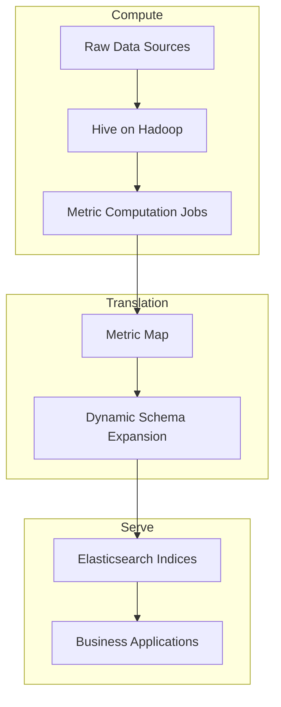

# System Design: Analytical Metric Platform

Enterprise Metrics — PB-Scale Hadoop, 100K+ Searchable Fields

---

## Functional Requirements

- Compute metrics from PB-scale analytical datasets on 1000+ vCore cluster
- Expose 100000+ searchable metric fields to business applications
- Support dynamic metric addition without manual schema migration
- Provide sub-second interactive search over metric values
- Handle Hive tables with 2000+ physical columns

## Non-functional Requirements

- Decouple batch computation from interactive search serving
- Optimize cluster resource utilization across concurrent workloads
- Maintain search performance as metric catalog grows
- Enable self-service metric discovery for business teams

---

## Architecture

---

## Component Design

### Hive Analytical Layer

**Role:** PB-scale batch computation generating metric values from raw
analytical datasets.

**Optimization focus:**

- Partition pruning reducing scan volume on 2000+ column tables
- Column pruning eliminating unnecessary I/O for metric-specific jobs
- Resource allocation standards preventing cluster contention

**Scale:** 1000+ vCore cluster, PB-scale HDFS storage.

### Metric Map

**Role:** Translation layer mapping Hive physical columns to logical metric
definitions.

**Structure:**

- Logical metric ID → Hive column reference(s)
- Metric metadata: name, description, computation logic, refresh schedule
- Version tracking for metric definition changes

**Design principle:** Business consumers reference logical metrics, never
physical Hive columns.

### Dynamic Schema Expansion

**Problem:** Elasticsearch index field limits (~1000 fields) conflict with
100000+ searchable metric requirements.

**Solution:** Map-based schema translation that groups metrics into index
structures without 1:1 column-to-field mapping.

**Mechanism:**

- Metric Map output partitioned into index-compatible groups
- Dynamic field allocation within index templates
- Schema expansion triggered on metric onboarding, not manual index rebuild

### Elasticsearch Serving Layer

**Role:** Interactive search engine for business applications.

**Index design:**

- Sharded indices for horizontal query scaling
- Replica configuration for read availability
- Field mapping optimized for metric search and aggregation patterns

**Scale:** 100000+ searchable fields across index fleet.

---

## Storage

| Layer | Data | Scale |
|-------|------|-------|
| HDFS | Raw and intermediate analytical data | PB-scale |
| Hive tables | Computed metric values, 2000+ columns | 1000+ vCore compute |
| Elasticsearch | Searchable metric indices | 100000+ fields |
| Metric Map catalog | Metric definitions and mappings | Grows with metric count |

---

## Computing

- Hive on MapReduce/Spark engine for batch metric computation
- Scheduled jobs producing metric refresh on daily/hourly cadence
- Resource isolation preventing concurrent job contention on shared cluster
- Spark and Flink available for specialized computation patterns

---

## Scheduling

- Batch job scheduler managing metric computation pipeline execution order
- Dependency-aware scheduling: upstream metrics computed before dependents
- Resource quota allocation per job priority class
- Metric refresh SLA tracking with alerting on computation delays

---

## Failure Recovery

| Failure Type | Recovery Strategy |
|--------------|-------------------|
| Hive job task failure | Task-level retry within job |
| HDFS block loss | Replication recovery from remaining replicas |
| Metric Map translation error | Version rollback to last valid mapping |
| Elasticsearch shard failure | Replica promotion; automatic rebalancing |
| Schema expansion conflict | Validation gate blocks invalid index updates |

---

## Scalability

- **Compute:** Horizontal worker node addition on 1000+ vCore cluster
- **Storage:** HDFS block replication and datanode expansion for PB growth
- **Translation:** Metric Map scales linearly with metric catalog size
- **Search:** Elasticsearch shard and replica scaling for query throughput

---

## Monitoring

- Hive job execution time and resource consumption per metric batch
- Cluster utilization across 1000+ vCore allocation
- Elasticsearch query latency p50/p95/p99
- Metric Map catalog size and onboarding rate
- Schema expansion success/failure rate during metric addition

---

## Security

- HDFS access controls restricting raw data to computation jobs
- Elasticsearch index-level access for business application isolation
- Metric Map change audit trail for definition modifications
- Role-based access for metric onboarding and schema expansion operations

---

## Trade-offs

| Choice | Alternative Considered | Why This Choice |
|--------|----------------------|-----------------|
| Hive batch compute | Real-time streaming compute | Metric use case tolerates batch freshness |
| Elasticsearch serving | Direct Hive query serving | Interactive search requires sub-second latency |
| Map-based schema expansion | One index per metric | Field limits make direct mapping infeasible |
| PB-scale Hadoop retention | Migration to cloud warehouse | Leverages existing infrastructure investment |

---

## Future Improvements

- Incremental metric computation reducing full batch recomputation
- Unified metric catalog with end-to-end lineage visualization
- Automated schema compatibility validation during metric onboarding
- Query push-down reducing data movement between Hive and Elasticsearch
