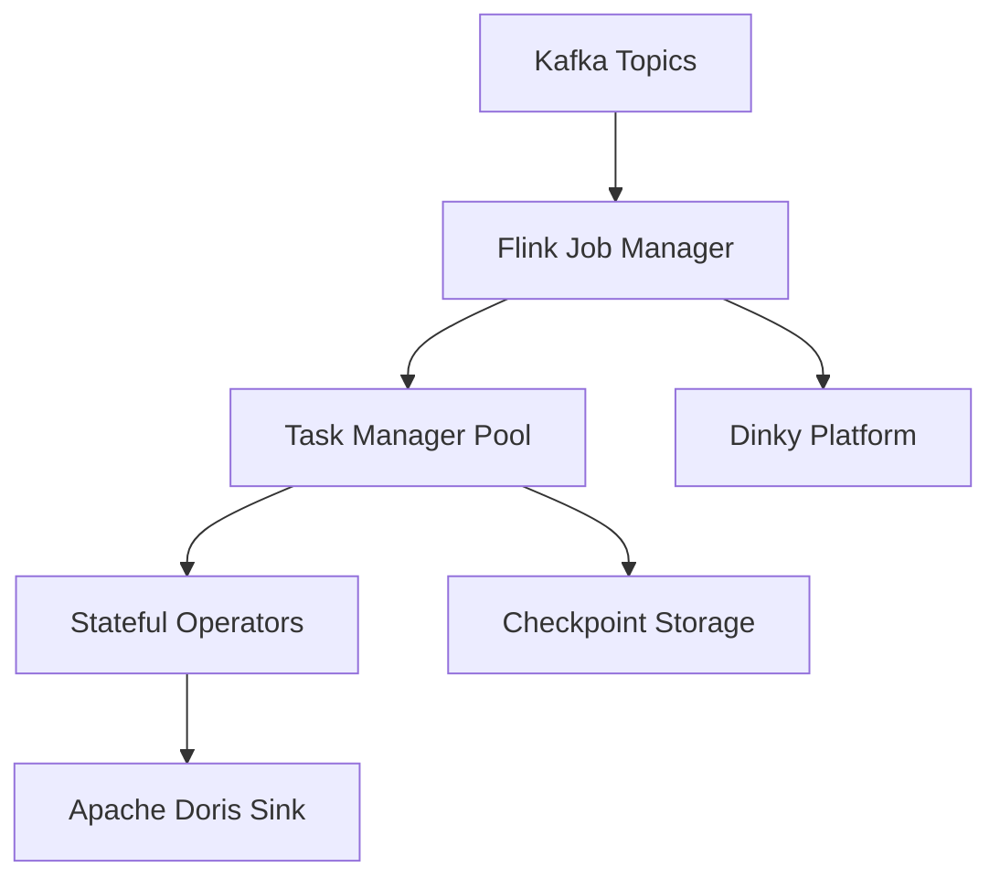

# System Design: Flink Stream Processing

1000+ vCore Cluster — Connected Vehicle Platform

---

## Context

Apache Flink is the stream processing engine for the connected vehicle platform
at Shanghai Jiayu Intelligent Robotics. Flink consumes telemetry from Kafka,
performs real-time aggregation and enrichment, and writes processed datasets
to Apache Doris for business API serving.

This document covers platform-level Flink design decisions at 1000+ vCore scale.

---

## Functional Requirements

- Process 10B+ telemetry events per day from Kafka ingestion layer
- Support stateful aggregation, enrichment, and routing job types
- Deliver processed data to Apache Doris real-time warehouse
- Enable job lifecycle management across 1000+ vCore cluster
- Provide exactly-once processing semantics for aggregation workloads

## Non-functional Requirements

- Processing decoupled from ingestion and serving layers
- Checkpoint-based failure recovery without full pipeline restart
- Operational tooling for job deployment, monitoring, and rollback
- Parallelism scaling aligned with Kafka partition count

---

## Architecture

---

## Job Types

### Real-time Aggregation

Windowed metrics over telemetry streams. Stateful operators accumulate counts,
averages, and distributions per vehicle, fleet, or time window.

**State management:** RocksDB state backend for large-state aggregation jobs
where in-memory state exceeds Task Manager capacity.

### Enrichment

Join telemetry events with reference data (vehicle model, fleet assignment).
Broadcast state pattern for low-cardinality reference datasets.

### Routing

Direct events to topic-specific downstream pipelines based on telemetry
category or business rules. Stateless operators with high throughput.

---

## Component Design

### Job Manager

Coordinates job execution, scheduling, and checkpoint coordination across Task
Manager pool. HA configuration for Job Manager failure recovery.

### Task Managers

Execute parallel subtasks across the 1000+ vCore cluster. Resource allocation
per job based on Kafka partition count and state requirements.

### Checkpointing

- Checkpoint interval balanced against recovery time and storage cost
- Exactly-once semantics for aggregation jobs writing to Doris
- Savepoint management for job upgrades without state loss

### Dinky Platform Integration

Operational interface for Flink job lifecycle at cluster scale:

- Job submission, versioning, and rollback
- Cluster monitoring and alerting
- Savepoint-triggered job upgrades

At 1000+ vCore scale, custom Flink management scripts do not scale.
Dinky integration reduced operational overhead compared to ad-hoc tooling.

---

## Scaling Strategy

- **Parallelism:** Aligned with Kafka partition count per consumer group
- **Cluster capacity:** Task Manager node addition for vCore expansion
- **State backend:** RocksDB for jobs exceeding in-memory state limits
- **Backpressure response:** Monitor operator backpressure metrics; scale
  parallelism or investigate upstream Kafka lag

---

## Failure Recovery

| Failure | Recovery |
|---------|----------|
| Task Manager failure | Checkpoint-based restart from last completed checkpoint |
| Job Manager failure | Standby Job Manager with HA configuration |
| Checkpoint failure | Alert and retry; investigate state backend storage |
| State corruption | Restore from savepoint prior to corruption event |
| Job logic bug | Rollback via Dinky savepoint to previous version |

---

## Monitoring

- Consumer lag per Kafka source connector
- Checkpoint success rate and duration
- Operator backpressure indicators per job
- Task Manager CPU, memory, and network utilization
- Records-in/records-out rates per operator chain

---

## Trade-offs

| Decision | Benefit | Cost |
|----------|---------|------|
| Flink over Spark Streaming | Mature stateful processing and exactly-once | Operational complexity at scale |
| RocksDB state backend | Large-state aggregation support | Disk I/O overhead vs. in-memory |
| Dinky integration | Standardized ops at 1000+ vCore | Third-party platform dependency |
| Doris sink vs. direct API serve | Analytical query capability for business apps | Additional data movement latency |

---

## Lessons Learned

- Parallelism planning must happen alongside Kafka partition design, not after
  production lag incidents.
- Checkpoint interval tuning requires measuring recovery time under realistic
  state sizes, not default configuration.
- Operational platform integration (Dinky) becomes a larger engineering
  investment than individual job optimization at 1000+ vCore scale.

---

## Future Improvements

- Auto-scaling Task Manager allocation based on Kafka consumer lag
- Unified job template library for common aggregation patterns
- Automated checkpoint failure root cause analysis
