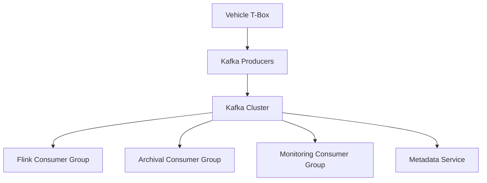

# System Design: Kafka Ingestion Layer

Connected Vehicle Platform — 1M+ Devices, 10B+ Events/Day

---

## Context

Kafka serves as the ingestion boundary in the connected vehicle streaming
platform at Shanghai Jiayu Intelligent Robotics. Vehicle T-Box devices produce
heterogeneous telemetry that must reach multiple downstream consumers without
coupling producers to processing capacity.

This document describes the Kafka layer design decisions, not Kafka tutorial
content.

---

## Functional Requirements

- Ingest telemetry from 1M+ connected vehicle T-Box devices
- Support 10B+ events per day throughput
- Enable multiple independent downstream consumers (Flink, archival, monitoring)
- Preserve per-vehicle ordering where required by downstream processing
- Absorb traffic bursts without backpressure to device connectivity

## Non-functional Requirements

- Ingestion decoupled from computation for independent scaling
- Durable message retention for replay and recovery scenarios
- Consumer group isolation between processing pipelines
- Operational visibility into lag and throughput per topic

---

## Architecture

---

## Topic Design

**Partitioning strategy**

- Partition by vehicle ID to maintain per-device message ordering
- Partition count sized for Flink consumer parallelism alignment
- Hot partition risk mitigated through hash distribution across vehicle fleet

**Topic organization**

- Separate topics by telemetry category where consumption patterns differ
- Shared topics where multiple consumers require identical event streams
- Retention policy balancing replay window against storage cost

**Design rationale**

Direct device-to-Flink coupling fails at 1M+ device scale. Kafka creates a
durable buffer between producers and consumers. Traffic bursts from peak hours
are absorbed by the broker layer rather than propagating to Flink Task Managers.

---

## Component Design

### Producer Layer

Vehicle T-Box devices and gateway services publish to Kafka topics. Producer
configuration balances batching efficiency against latency for time-sensitive
telemetry categories.

### Broker Cluster

Horizontal scaling through broker addition and partition expansion. Replication
factor configured for durability during broker failures.

### Consumer Groups

| Consumer Group | Purpose | Isolation |
|----------------|---------|-----------|
| Flink processing | Stream computation pipelines | Dedicated parallelism |
| Archival | Long-term storage ingestion | Independent lag tolerance |
| Monitoring | Operational metrics extraction | Low-priority consumption |

Consumer group isolation prevents one slow consumer from blocking others
reading the same topic.

### Metadata Integration

Kafka topic schemas registered in the platform metadata service. Downstream
teams discover available telemetry streams through the catalog rather than
direct broker inspection.

---

## Scaling Strategy

- **Throughput:** Partition expansion and broker horizontal scaling
- **Device growth:** Additional partitions accommodate new vehicle ID hash space
- **Consumer scaling:** Flink parallelism aligned with partition count
- **Storage:** Retention tuning based on replay requirements vs. disk cost

At platform scale: 1M+ devices, 10B+ events/day.

---

## Failure Recovery

| Failure | Recovery |
|---------|----------|
| Broker node failure | Replica promotion; producers retry |
| Producer send failure | Client retry with exponential backoff |
| Consumer lag spike | Scale Flink parallelism; investigate hot partitions |
| Schema incompatibility | Metadata governance blocks invalid message formats |

Burst traffic during peak hours is the primary operational challenge. Kafka
absorbs bursts; consumer lag monitoring triggers Flink scaling response.

---

## Trade-offs

| Decision | Benefit | Cost |
|----------|---------|------|
| Kafka as mandatory boundary | Producer-consumer decoupling | Cluster operational overhead |
| Vehicle ID partitioning | Per-device ordering | Hot partition risk for fleet subsets |
| Multiple consumer groups | Pipeline isolation | Increased total read throughput |
| Retention for replay | Recovery and reprocessing capability | Storage cost at 10B+ events/day |

---

## Lessons Learned

- Kafka decoupling is non-negotiable at national device scale. Direct coupling
  creates cascading failures during traffic bursts.
- Partition count should be planned alongside Flink parallelism from initial
  deployment, not retrofitted after lag incidents.
- Metadata integration at the topic level reduces downstream discovery friction
  as the telemetry catalog grows.

---

## Future Improvements

- Auto-scaling consumer parallelism based on lag thresholds
- Cross-region cluster replication for geographic disaster recovery
- Unified schema registry with automated compatibility validation
