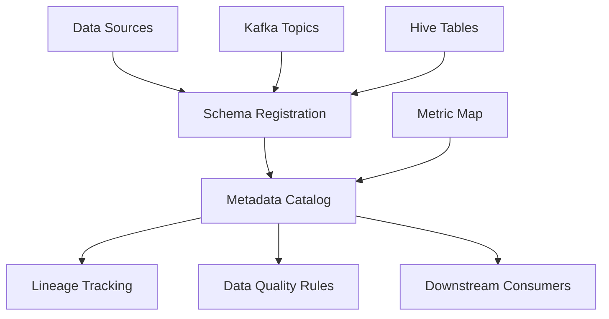

# System Design: Metadata and Data Governance

Platform-Level Data Discovery — Streaming and Analytical Domains

---

## Context

Metadata and data governance appear across two major platform builds:

- **Connected Vehicle Platform** (Jiayu): schema registration, lineage, and
  data quality for telemetry datasets at 1M+ device scale
- **Enterprise Metric Platform** (Ping An): metric catalog mapping logical
  definitions to physical Hive columns and Elasticsearch fields

This document describes metadata as a platform primitive, not a per-team
convention.

---

## Problem

At platform scale, data discovery and trust cannot rely on tribal knowledge:

- 1M+ vehicle models produce heterogeneous telemetry schemas
- 100000+ searchable metric fields require logical-to-physical mapping
- Downstream teams need self-service discovery without broker or Hive expertise
- Schema changes must be governed, not silently breaking consumers

Without platform-level metadata, every downstream integration requires direct
coordination with the platform team.

---

## Functional Requirements

- Register and version schemas for telemetry and metric datasets
- Track lineage from source through processing to serving layer
- Enforce data quality rules at ingestion and processing boundaries
- Provide searchable catalog for downstream team self-service
- Govern schema evolution with compatibility validation

## Non-functional Requirements

- Metadata services scale independently from processing workloads
- Schema changes auditable with change history
- Integration with Kafka topic catalog and Metric Map layer
- Consistent governance standards across platform teams

---

## Architecture



---

## Component Design

### Schema Registration

**Streaming domain (Jiayu)**

Telemetry message formats registered per vehicle model and topic. Schema
versions tracked for evolution across firmware updates and new vehicle types.

**Analytical domain (Ping An)**

Metric Map catalog maps logical metric IDs to Hive column references. Metric
metadata includes name, description, computation logic, and refresh schedule.

### Lineage Tracking

End-to-end data flow documentation:

```
Vehicle T-Box → Kafka Topic → Flink Job → Doris Table → Business API
Hive Table → Metric Computation → Metric Map → Elasticsearch Index
```

Lineage enables impact analysis when upstream schemas change.

### Data Quality Rules

Rules enforced at platform boundaries:

- Ingestion boundary: reject or quarantine messages failing schema validation
- Processing boundary: flag aggregation anomalies in telemetry streams
- Serving boundary: validate metric values before Elasticsearch indexing

### Data Governance Standards

Platform-wide conventions replacing per-team practices:

- Naming standards for topics, tables, and metric definitions
- Ownership assignment for each registered dataset
- Change approval workflow for schema modifications affecting downstream consumers

---

## Scaling Strategy

- Metadata catalog grows with dataset count, not event volume
- Schema registration is write-light, read-heavy — optimized for catalog queries
- Lineage graph scales with pipeline count, manageable independently from
  10B+ events/day processing throughput

---

## Failure Recovery

| Scenario | Response |
|----------|----------|
| Schema incompatibility detected | Block ingestion; notify dataset owner |
| Lineage gap discovered | Audit pipeline registration; backfill metadata |
| Quality rule violation spike | Alert platform team; investigate upstream source |
| Catalog service unavailable | Read replicas serve discovery; writes queued |

---

## Trade-offs

| Decision | Benefit | Cost |
|----------|---------|------|
| Platform-level governance vs. per-team | Consistent discovery and trust | Onboarding friction for new datasets |
| Schema validation at ingestion | Early failure detection | Processing latency for validation step |
| Metric Map indirection | 100K+ logical metrics manageable | Translation layer maintenance |
| Lineage tracking | Impact analysis on schema changes | Registration overhead per pipeline |

---

## Lessons Learned

- Metadata and governance must be platform capabilities from initial deployment.
  Retrofitting after dataset proliferation requires expensive catalog backfill.
- At 1M+ device scale, schema evolution is continuous, not episodic. Governance
  workflows must accommodate frequent minor changes without blocking velocity.
- Metric Map at 100K+ field scale is metadata architecture, not a spreadsheet.

---

## Future Improvements

- Automated schema compatibility checking in CI pipeline
- Self-service metric onboarding with validation gates
- Unified catalog spanning streaming and analytical domains
