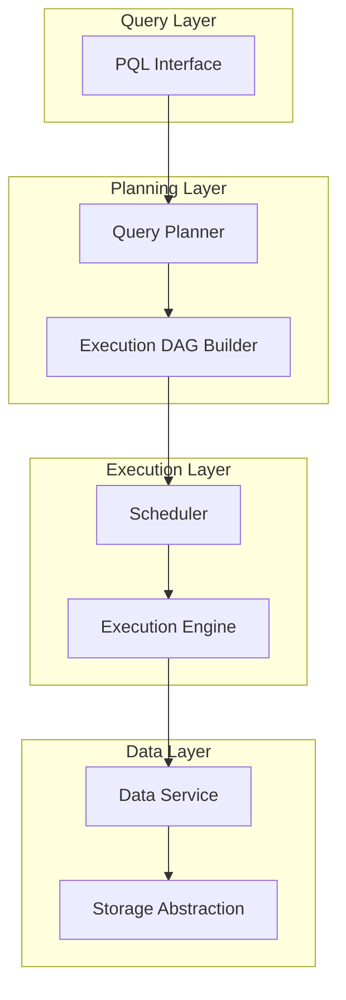

# System Design: Privacy Computing Execution Platform

---

## Functional Requirements

- Accept declarative PQL queries and produce executable distributed plans
- Execute cross-party computation workflows as distributed DAGs
- Provide unified data read/write access across storage backends
- Support benchmark-driven performance evaluation
- Deploy execution engines on Kubernetes with container isolation

## Non-functional Requirements

- Planner, scheduler, and execution engine components evolve independently
- Platform interfaces standardized across all integration points
- Execution planning latency acceptable for interactive query submission
- Failure recovery at DAG stage granularity, not full query restart

---

## Architecture

---

## Component Design

### Query Planner

**Input:** PQL query with computation semantics and data references.

**Output:** Logical execution plan with operators, dependencies, and
estimated costs.

**Responsibilities:**

- Parse PQL into logical operator tree
- Rewrite operators for execution efficiency
- Generate cost-aware execution graph
- Separate query semantics from execution strategy selection

### Execution DAG

**Structure:** Directed acyclic graph where nodes represent computation stages
and edges represent data dependencies.

**Properties:**

- Stage boundaries define retry and checkpoint units
- Parallel stages execute concurrently when dependencies resolve
- Cross-party stages enforce data isolation constraints

### Scheduler

**Input:** Execution DAG with stage metadata and resource requirements.

**Output:** Stage assignments to available execution engines.

**Responsibilities:**

- Dependency resolution determining ready stages
- Resource allocation across engine pool
- Stage completion tracking for partial recovery

### Data Service

**Interface contract:**

- Read(dataRef, partition) → data stream
- Write(dataRef, partition, data) → acknowledgment
- Idempotent operations for retry safety

**Design principle:** Execution engines never access storage directly.

### Storage Abstraction

**Interface contract:**

- Backend registration and capability discovery
- Push-down predicate filtering where supported
- Consistent error semantics across backends

---

## Storage

| Layer | Role | Technology |
|-------|------|------------|
| Execution state | DAG stage completion tracking | Platform-managed store |
| Intermediate data | Cross-stage data exchange | Storage abstraction backends |
| Benchmark results | Performance measurement history | Benchmark platform store |

Storage abstraction decouples execution engines from physical storage
implementations, enabling backend portability across deployment environments.

---

## Computing

- Execution engines run as containerized workloads on Kubernetes
- Flink provides stream and batch computation capabilities within engines
- Planner runs as stateless service, horizontally scalable
- Scheduler maintains stage state for dependency tracking and recovery

---

## Scheduling

- DAG-based scheduling with dependency-aware stage dispatch
- Stage-level retry on failure, preserving completed stage results
- Resource allocation based on stage compute and memory requirements
- Benchmark platform informs scheduling parameter tuning

---

## Failure Recovery

| Failure Type | Recovery Strategy |
|--------------|-------------------|
| Planner failure | Stateless retry; no state loss |
| Stage execution failure | Retry failed stage; completed stages preserved |
| Data Service timeout | Idempotent retry with same partition key |
| Storage backend failure | Abstraction layer routes to replica or fails stage |
| Scheduler failure | Recover stage completion state; resume dispatch |

---

## Scalability

- **Planner:** Horizontal scaling via stateless instances behind load balancer
- **Scheduler:** Partition DAG queue by query for parallel dispatch
- **Execution Engine:** Kubernetes pod scaling based on pending stage queue
- **Data Service:** Scale with storage backend throughput capacity

---

## Monitoring

- Stage execution latency and success rate per DAG
- Planner query-to-plan conversion time
- Data Service read/write throughput and error rate
- Storage abstraction backend health and latency
- Benchmark platform trend tracking for regression detection

---

## Security

- Cross-party data isolation enforced at DAG stage boundaries
- Container isolation via Kubernetes namespace and network policies
- Data Service access controlled through platform authentication
- Storage abstraction credentials managed per backend, not per engine

---

## Trade-offs

| Choice | Alternative Considered | Why This Choice |
|--------|----------------------|-----------------|
| Dedicated planner | Template-based jobs | Query variability requires adaptive planning |
| DAG stage granularity | Task-level or job-level | Balance between recovery cost and parallelism |
| Storage abstraction | Direct engine-to-storage | Backend portability across deployments |
| Benchmark platform | Ad-hoc profiling | Measurable optimization at platform scale |

---

## Future Improvements

- Historical cost model for plan selection optimization
- Runtime-adaptive DAG rewriting based on stage performance feedback
- Federated scheduling across multiple Kubernetes clusters
- Automated benchmark regression detection in CI pipeline
