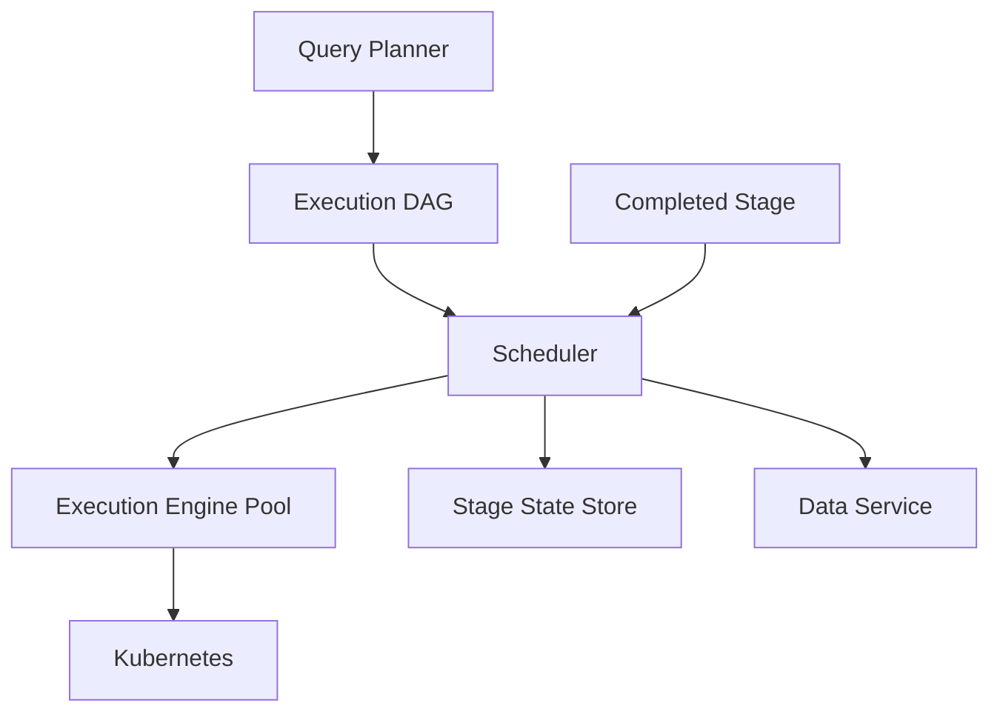

# System Design: Distributed Scheduler

MIRA Privacy Computing Platform — DAG Stage Dispatch

---

## Context

The scheduler is a core component in the MIRA privacy computing platform at
Shanghai Puxin Future Internet Research Institute. It receives execution DAGs
from the query planner and dispatches stages to available execution engines
running on Kubernetes.

This document describes scheduler design within the platform architecture:

```
PQL → Planner → Execution DAG → Scheduler → Execution Engine → Data Service → Storage
```

---

## Functional Requirements

- Accept execution DAGs with stage dependencies and resource requirements
- Dispatch ready stages to available execution engines
- Track stage completion state for dependency resolution
- Support stage-level retry on failure without full query restart
- Allocate resources across heterogeneous execution engine pool

## Non-functional Requirements

- Scheduler state recoverable after process failure
- Stage dispatch latency acceptable for interactive query workloads
- Independent evolution from planner and execution engine interfaces
- Kubernetes-aware resource allocation for containerized engines

---

## Architecture



---

## Component Design

### DAG Input

Execution DAG from the query planner. Each node represents a computation stage
with:

- Dependency list (upstream stages that must complete first)
- Resource requirements (CPU, memory, engine type)
- Data references for input/output via Data Service

### Dependency Resolution

Scheduler maintains a ready queue of stages whose dependencies are satisfied.
Parallel stages dispatch concurrently when independent.

**Stage boundary semantics:**

- Stage is the unit of retry — failed stage restarts without re-executing
  completed upstream stages
- Stage is the unit of checkpoint — completion state persisted before
  downstream dispatch

### Resource Allocation

Stage assignments match engine capabilities in the execution engine pool.
Kubernetes provides container isolation and elastic scaling for engine instances.

### Stage State Store

Persistent tracking of:

- Stage status: pending, running, completed, failed
- Assignment history for retry decisions
- Query-level progress for partial recovery

---

## Scheduling Flow

1. Planner submits Execution DAG to scheduler
2. Scheduler identifies root stages (no dependencies) and adds to ready queue
3. Ready stages dispatched to available execution engines
4. Engine completes stage; reports completion to scheduler via Data Service
5. Scheduler marks stage complete; evaluates newly ready downstream stages
6. Repeat until all stages complete or unrecoverable failure

---

## Failure Recovery

| Failure | Recovery |
|---------|----------|
| Stage execution failure | Retry failed stage; preserve completed stage results |
| Engine pool exhaustion | Queue ready stages; scale Kubernetes pods |
| Scheduler process failure | Recover stage state from store; resume dispatch |
| Dependency deadlock | Alert; planner review for cyclic DAG (should not occur) |
| Data Service timeout during stage | Idempotent stage retry |

Stage-level granularity is the key design decision. Full query restart on
single stage failure wastes completed computation across multi-stage privacy
workflows.

---

## Scaling Strategy

- **Scheduler instances:** Horizontal scaling with partitioned DAG queue
- **Engine pool:** Kubernetes pod scaling based on pending stage queue depth
- **State store:** Scales with concurrent query count, not data volume
- **Benchmark platform:** Informs scheduling parameter tuning with measured
  stage execution times

---

## Monitoring

- Stage dispatch latency from ready queue to engine assignment
- Stage completion rate and failure rate per query pattern
- Engine pool utilization and pending queue depth
- End-to-end query completion time from DAG submission to final stage
- Retry count distribution per stage type

---

## Trade-offs

| Decision | Benefit | Cost |
|----------|---------|------|
| Stage-level retry vs. query-level | Preserves completed work | Scheduler state complexity |
| Centralized scheduler vs. per-engine | Unified dependency tracking | Scheduler as potential bottleneck |
| Kubernetes engine pool vs. static | Elastic scaling | Container orchestration overhead |
| Persistent stage state vs. in-memory | Recovery after scheduler failure | State store operational cost |

---

## Lessons Learned

- Stage boundary definition in the DAG model directly determines retry
  granularity and recovery cost. Define stage boundaries during planner design,
  not during scheduler implementation.
- Scheduler interfaces must be standardized alongside planner and engine
  interfaces. Retrofit standardization across three components is significantly
  more expensive than upfront design.
- Benchmark platform data improves scheduling parameter tuning more than
  static resource allocation rules.

---

## Future Improvements

- Cost-based stage placement using historical execution statistics
- Cross-query resource sharing for compatible stage types
- Adaptive retry policies based on failure category
- Federated scheduling across multiple Kubernetes clusters
