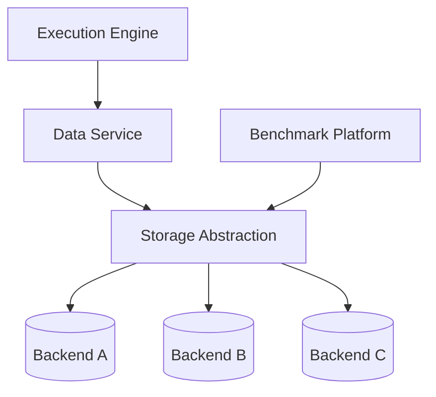

# System Design: Storage Abstraction Layer

MIRA Platform and Multi-Domain Storage Architecture

---

## Context

Storage abstraction appears as a platform design pattern across multiple domains:

- **MIRA Privacy Computing Platform:** Data Service and storage abstraction
  decouple execution engines from physical storage backends
- **Connected Vehicle Platform:** layered storage from Kafka through Doris
- **Enterprise Metric Platform:** HDFS, Hive, and Elasticsearch serving distinct
  storage roles in the compute-serve pattern

This document focuses on the storage abstraction design in MIRA and the
cross-domain storage layer patterns.

---

## Problem

Execution engines that bind directly to storage implementations create:

- Per-backend integration code for each new storage deployment
- Inability to migrate storage without rewriting execution logic
- Inconsistent error handling and retry semantics across engines
- Testing complexity requiring specific storage infrastructure

Storage abstraction solves these by introducing a stable interface between
computation and persistence.

---

## Functional Requirements

- Unified read/write data access for execution engines
- Support multiple storage backends through consistent contract
- Idempotent operations enabling safe stage-level retry
- Backend capability discovery for push-down optimization
- Benchmark platform integration for storage performance measurement

## Non-functional Requirements

- Interface thin enough to avoid significant indirection latency
- Backend registration without execution engine code changes
- Consistent error semantics across heterogeneous backends
- Credential management per backend, not per engine instance

---

## Architecture



---

## MIRA Storage Stack

### Data Service

Interface contract for execution engines:

- `Read(dataRef, partition)` → data stream
- `Write(dataRef, partition, data)` → acknowledgment

Execution engines never access storage directly. All data paths flow through
Data Service, enabling backend substitution without engine modification.

### Storage Abstraction

Backend registration and capability discovery:

- Register storage backend with supported operations
- Push-down predicate filtering where backend supports it
- Consistent error semantics: retryable vs. fatal failures
- Credential isolation per backend deployment

### Physical Backends

Deployment-specific storage implementations registered through abstraction
layer. Execution engine code remains identical across deployments with
different backend configurations.

---

## Multi-Domain Storage Patterns

### Privacy Computing (MIRA)

```
Execution Engine → Data Service → Storage Abstraction → Physical Backend
```

Abstraction enables backend portability across deployment environments.

### Streaming (Connected Vehicle)

| Layer | Storage Role | Technology |
|-------|-------------|------------|
| Ingestion buffer | Durable event log | Kafka |
| Processing state | Aggregation windows | Flink RocksDB state |
| Serving store | Analytical queries | Apache Doris |
| Raw archive | Long-term retention | Platform-defined |

Each layer serves a distinct access pattern. No single storage system serves
all roles.

### Analytical (Metric Platform)

| Layer | Storage Role | Technology |
|-------|-------------|------------|
| Raw/compute | Batch analytical data | HDFS |
| Computation | Metric values | Hive tables |
| Serving | Interactive search | Elasticsearch |

Compute-serve separation: Hive computes, Elasticsearch serves. Storage choice
follows access pattern, not technology preference.

---

## Component Design

### Read Path

1. Execution engine requests data via Data Service read interface
2. Data Service resolves dataRef to storage backend via abstraction layer
3. Abstraction layer applies push-down filters if backend supports them
4. Data stream returned to engine with consistent error semantics

### Write Path

1. Execution engine writes via Data Service write interface
2. Data Service validates partition key and idempotency token
3. Abstraction layer routes to registered backend
4. Acknowledgment returned; retry safe on timeout due to idempotent contract

### Backend Registration

New backends register capabilities without execution engine changes:

- Supported operations (read, write, push-down filter)
- Connection configuration and credential scope
- Performance characteristics for planner cost estimation

---

## Failure Recovery

| Failure | Recovery |
|---------|----------|
| Backend timeout | Idempotent retry with same partition key |
| Backend node failure | Abstraction routes to replica or fails stage |
| Write partial failure | Idempotent rewrite; stage-level retry |
| Backend registration error | Engine pool excludes failed backend; alert ops |

---

## Trade-offs

| Decision | Benefit | Cost |
|----------|---------|------|
| Storage abstraction vs. direct access | Backend portability | Interface indirection latency |
| Idempotent write contract | Safe stage retry | Duplicate detection overhead |
| Push-down filter support | Reduced data movement | Backend-specific implementation |
| Layered storage vs. single store | Optimized per access pattern | Operational complexity |

---

## Lessons Learned

- Storage abstraction pays off when multiple execution backends or deployment
  environments exist. For single-backend, single-deployment systems, abstraction
  adds cost without benefit.
- Idempotent Data Service operations are prerequisites for stage-level retry
  in the scheduler. Design write semantics before scheduler implementation.
- In streaming and analytical domains, layered storage (Kafka/Flink/Doris or
  Hive/Elasticsearch) outperforms single-store designs because access patterns
  differ fundamentally between ingestion, computation, and serving.

---

## Future Improvements

- Extended push-down optimization reducing data movement at abstraction layer
- Storage performance feedback to query planner for cost-based plan selection
- Unified storage catalog spanning privacy, streaming, and analytical domains
- Automated backend health routing with failover
