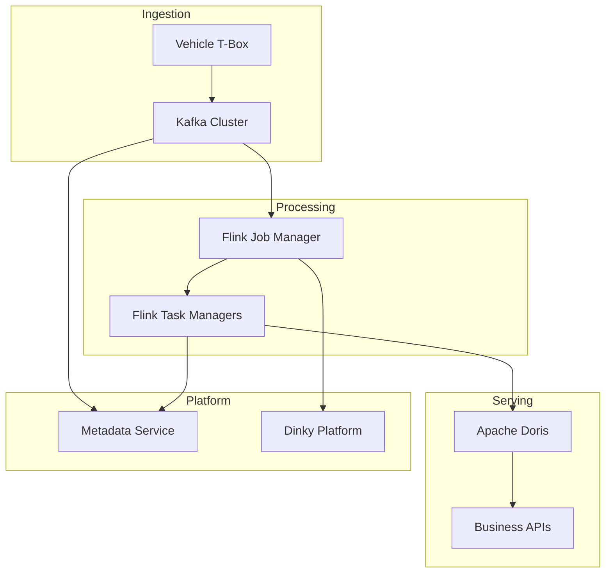

# System Design: Stream Processing Platform

Connected Vehicle Telematics — 10B+ Events/Day

---

## Functional Requirements

- Ingest telemetry from 1M+ connected vehicle T-Box devices
- Process 10B+ events per day through real-time stream computation
- Serve processed data to business applications via low-latency queries
- Provide metadata catalog and data governance for downstream teams
- Support Flink job lifecycle management across 1000+ vCore cluster

## Non-functional Requirements

- Ingestion decoupled from computation for independent scaling
- Exactly-once processing semantics for aggregation workloads
- Sub-minute data freshness from ingestion to serving layer
- Operational tooling for job deployment, monitoring, and recovery

---

## Architecture

---

## Component Design

### Kafka Ingestion Layer

**Topic design:**

- Topics partitioned by vehicle ID for ordering per device
- Retention policy balancing replay capability against storage cost
- Consumer groups isolated per downstream processing pipeline

**Scaling:** Broker and partition expansion as device count and event rate grow.

### Flink Stream Processing

**Job types:**

- Real-time aggregation: windowed metrics over telemetry streams
- Enrichment: join telemetry with reference data (vehicle model, fleet)
- Routing: direct events to topic-specific downstream pipelines

**State management:**

- RocksDB state backend for large-state aggregation jobs
- Checkpointing interval balanced against recovery time and storage cost

### Apache Doris Real-time Warehouse

**Table design:**

- Columnar storage optimized for time-series query patterns
- Partition by date for efficient range queries and retention management
- Aggregate tables pre-computing common business query patterns

### Metadata and Data Governance

**Capabilities:**

- Schema registration for telemetry message formats
- Lineage tracking from Kafka topic through Flink job to Doris table
- Data quality rules enforced at ingestion and processing boundaries

### Dinky Platform Integration

**Operational workflows:**

- Flink job submission, versioning, and rollback
- Cluster monitoring and alerting
- Savepoint management for job upgrades without state loss

---

## Storage

| Layer | Data | Retention |
|-------|------|-----------|
| Kafka | Raw telemetry events | Configurable replay window |
| Flink state | Aggregation windows, enrichment caches | Job lifecycle |
| Doris | Processed analytical datasets | Business-defined retention |
| Metadata | Schemas, lineage, quality rules | Permanent catalog |

---

## Computing

- 1000+ vCore Flink cluster distributed across Task Managers
- Parallelism configured per job based on Kafka partition count and compute
  requirements
- Job Manager handles coordination; Task Managers execute parallel subtasks
- Dinky provides operational interface for job management at cluster scale

---

## Scheduling

- Flink internal scheduling manages subtask parallelism within jobs
- Kafka consumer group rebalancing distributes partition consumption
- Doris load scheduling manages data ingestion from Flink sinks
- Dinky schedules job deployments and savepoint operations

---

## Failure Recovery

| Failure Type | Recovery Strategy |
|--------------|-------------------|
| Kafka broker failure | Replica promotion; producers retry |
| Flink Task Manager failure | Checkpoint-based restart from last savepoint |
| Flink Job Manager failure | Standby Job Manager with HA configuration |
| Doris BE node failure | Replica serving; automatic rebalancing |
| Schema incompatibility | Metadata governance blocks invalid ingestion |

---

## Scalability

- **Ingestion:** Kafka partition expansion; additional brokers for throughput
- **Processing:** Flink parallelism increase; Task Manager node addition
- **Serving:** Doris BE node scaling for storage and query capacity
- **Metadata:** Independent scaling as dataset catalog grows

At current scale: 1M+ devices, 10B+ events/day, 1000+ vCore cluster.

---

## Monitoring

- Kafka consumer lag per topic and consumer group
- Flink job checkpoint success rate and duration
- Flink backpressure metrics per operator
- Doris query latency and load throughput
- Data quality rule violation counts from governance layer

---

## Security

- Kafka ACLs restricting topic access per consumer group
- Network isolation between ingestion, processing, and serving tiers
- Metadata access controlled through platform authentication
- Vehicle data anonymization at processing boundary where required

---

## Trade-offs

| Choice | Alternative Considered | Why This Choice |
|--------|----------------------|-----------------|
| Kafka ingestion boundary | Direct device-to-Flink | Decoupling essential at 1M+ device scale |
| Flink over Spark Streaming | Spark Structured Streaming | Stateful processing maturity and ops tooling |
| Doris serving layer | Serve from Flink state | Business queries require ad-hoc analytical access |
| Dinky over custom ops | Custom Flink management scripts | Standardized ops at 1000+ vCore scale |

---

## Future Improvements

- Auto-scaling Flink parallelism based on Kafka consumer lag thresholds
- Unified schema registry with backward/forward compatibility enforcement
- Cross-region Kafka replication for geographic disaster recovery
- Stream-table duality reducing Flink-to-Doris synchronization complexity
